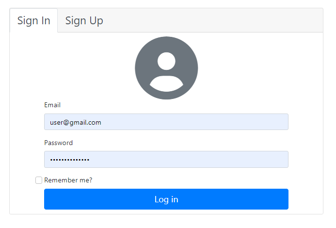
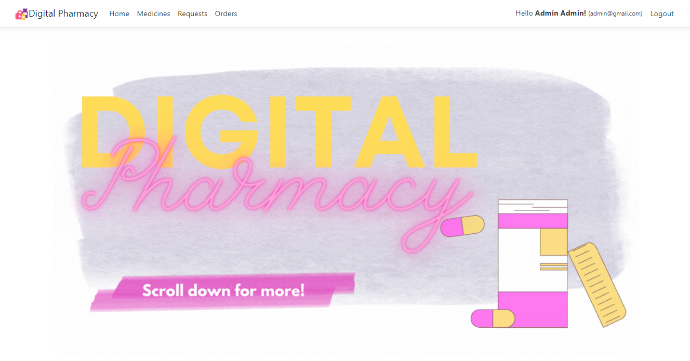

  <h3 align="center">PharmacyApp </h3>

## Description

This project was done for a university course (New Generation Programming Language - ASP.NET)

* As we live in a digital era, people nowadays cannot get away from technology that easily, for that the online pharmacy application that is implemented in web technologies, made it a great way to facilitate medicine browsing in a pharmacy, where customers can check for a certain product and check if it is in stock, as well as do a request of the product to buy directly from the pharmacy.
* The pharmacy app is a web application that consists of two elements: a server that performs the base functionality and a user interface that is run by customer. 
* In this application customers can save time just by accessing the web app anytime and anywhere through the computer or their smartphones.
* It has 3 main features:
•	Search for drugs
•	Request a drug (for pickup)
•	Digital Inventory; that shows users real time drugs quantity
* The purpose of our application is designed to provide a customer with the ability to quickly discover the drugs they need that are available, as well check the pricing for the drug if any user is curious to compare the price to other pharmacies.

## Getting Started

### Screens
<figure>
  <figcaption>Sign Up</figcaption>

</figure>
<figure>
  <figcaption>Homapage screen</figcaption>

</figure>
<figure>
  <figcaption>Medicine Admin View</figcaption>

</figure>
<figure>
  <figcaption>Instuctor Homepage</figcaption>

</figure>

### Technical environment used

* C# / ASP.NET Core
* Database: Microsoft SQL server

## Getting Started
* In conclusion, a Pharmacy Application is a good solution for the difficulties that were addressed through the proposed system of this study, especially in this pandemic condition where going to places has been harder than before. 
* Although the requirements model for the app has been successfully implemented, there is still room for improvements. 
* At present, the prototype does not have fully functional requirements for enhancing the pharmacy environment, like a prescription section that allows the admin/pharmacist to prescribe medicines for the customers.
* In addition, the model can also be improved by having an E-Pharmacy that can deliver drugs and where customers can pay directly through the app.

## Authors

Contributors names

* [Gabriella Shebly](https://beacons.ai/gabz.edu)
* Jamil Al Masry

(<a href="#top">back to top</a>)

